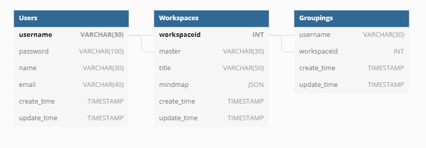

# Minders REST API
[](https://www.python.org/downloads/release/python-360/)

**Minders REST API**는 Minders REST API 프로젝트입니다.

## Tables

* [Architecture diagram](#architecture-diagram)
* [Prerequisites](#prerequisites)
* [Database ERD](#database-erd)
* [Model information](#model-information)
* [Running project](#running-project)
* [API service](#api-service)

## Architecture Diagram


## Prerequisites
프로젝트를 실행시키기 위해 필요한 소프트웨어.

### Install:
- [Docker](https://docs.docker.com/get-docker/)
- [Python 3.9+ (pip)](https://www.python.org/)
- [Docker-compose](https://docs.docker.com/compose/install/)

## Database ERD


## Model information
- [Raw Data](https://dumps.wikimedia.org/kowiki/latest/kowiki-latest-pages-articles.xml.bz2)
- [Data Processing](https://github.com/mungiyo/wikitext_nouns_extractor.git)
- Model Shape

```sh
(148481, 100)
```

## Running Project
`manage.sh` 스크립트는 `docker-compose`를 작동시키기 위한 관리 도구입니다.

- Build project infrastructure

```sh
./manage.sh start
```

- Stop project infrastructure

```sh
./manage.sh stop
```

- Down project infrastructure

```sh
./manage.sh down
```

## API service
프로젝트를 실행시켰을 때 사용할 수 있는 API 입니다.

### Example:
- REST API Documents
```
http://localhost
```
